# Polyglot Codebase Knowledge Graph

> Generated offline by **readmenator**. 6 files, 8 symbols, 1 imports. Supports C, C++, Python, Go, Rust, JS/TS, Java, C#, Shell, PHP, Dart, GDScript, Nim, ASM, Ruby, Swift, Kotlin, Scala, Lua, Elixir.
> No LLMs. No tokens. Pure static analysis. See more [here](https://github.com/grisuno/ReadMenator)

**Start here:** Statistics Dashboard for scope, God Nodes for blast radius, Architecture Reference for per-file API. Agents: prefer `readmenator-agent/INDEX.md` + `SYMBOLS.md`.

**Wiki:** prefer `readmenator-wiki/index.md` for progressive disclosure: one synthesis page per community, `connections.json` with EXTRACTED vs INFERRED confidence, `queries.md` log, `REPORT.md` audit.

**Confidence:** EXTRACTED = parsed from source, INFERRED = heuristic bridge, AMBIGUOUS = reported, never hidden. See `readmenator-wiki/REPORT.md`.

**Total Files Parsed:** 6 | **Total Symbols Extracted:** 8 | **Total Imports:** 1

<!-- ranking_model: v1.0 | weights: {ppr:0.45,auth:0.2,test:0.15,doc:0.1,fresh:0.1} | alpha:0.85 | commit:b3ca3bb | date:2026-07-18 -->


## Table of Contents

1. [Statistics Dashboard](#statistics-dashboard)
2. [Architectural Layers](#architectural-layers)
3. [Ranked Context](#ranked-context)
4. [God Nodes](#god-nodes)
5. [Suggested Questions](#suggested-questions)
6. [Hotspot Analysis](#hotspot-analysis)
7. [Change Impact Analysis](#change-impact-analysis)
8. [Suggested Linting Rules](#suggested-linting-rules)
9. [Dataflow Analysis](#dataflow-analysis)
10. [Orphans](#orphans)
11. [Query Recipes](#query-recipes)
12. [Structural Knowledge Map](#structural-knowledge-map)
13. [UML Class Diagram](#uml-class-diagram)
14. [Code Property Graph](#code-property-graph)
15. [Architecture Reference](#architecture-reference)
    - [PY (1 files)](#py-1-files)
    - [SH (5 files)](#sh-5-files)

---

## Statistics Dashboard

| Metric | Value |
|--------|-------|
| Total Files | 6 |
| Total Symbols | 8 |
| Total Imports | 1 |
| Call Edges | 0 |
| Inheritance Edges | 0 |
| Languages | 2 |
| Avg Symbols/File | 1.3 |
| Avg Imports/File | 0.2 |

### Top Files by Import Count (Fan-Out)

| File | Imports | Symbols | Language |
|------|---------|---------|----------|
| `app.py` | 1 | 0 | py |

---

## Architectural Layers

Auto-detected from path patterns, naming conventions, and imported frameworks.

| Layer | Files |
|-------|-------|
| utility | 6 |

### utility

- `app.py` (py, 0 symbols)
- `gen_ebird3.sh` (sh, 2 symbols)
- `gen_hellbird.sh` (sh, 2 symbols)
- `gen_hellbird2.sh` (sh, 2 symbols)
- `gen_hellbird3.sh` (sh, 2 symbols)
- `install.sh` (sh, 0 symbols)

---

## Ranked Context

Files ranked by composite score for the current query context. The ranking combines Personalized PageRank (query relevance), global authority, test coverage, documentation coverage, and code freshness. Model: v1.0.

| Rank | File | Composite | PPR | Authority | Test | Doc |
|------|------|-----------|-----|-----------|------|-----|
| 1 | `gen_hellbird.sh` | 0.1500 | 0.0000 | 0.0000 | 0.00 | 1.50 |
| 2 | `gen_hellbird2.sh` | 0.1500 | 0.0000 | 0.0000 | 0.00 | 1.50 |
| 3 | `gen_hellbird3.sh` | 0.1500 | 0.0000 | 0.0000 | 0.00 | 1.50 |
| 4 | `app.py` | 0.1000 | 0.0000 | 0.0000 | 0.00 | 1.00 |
| 5 | `gen_ebird3.sh` | 0.0500 | 0.0000 | 0.0000 | 0.00 | 0.50 |
| 6 | `install.sh` | 0.0000 | 0.0000 | 0.0000 | 0.00 | 0.00 |

---

## God Nodes

Most architecturally central files ranked by combined import/export degree and symbol richness.

| File | Score | Connections | PageRank |
|------|-------|-------------|----------|
| `gen_ebird3.sh` | 0.2 | | 0.0000 |
| `gen_hellbird.sh` | 0.2 | | 0.0000 |
| `gen_hellbird2.sh` | 0.2 | | 0.0000 |
| `gen_hellbird3.sh` | 0.2 | | 0.0000 |
| `app.py` | 0.0 | | 0.0000 |
| `install.sh` | 0.0 | | 0.0000 |

---

## Suggested Questions

Auto-generated exploration prompts based on graph structure:

- What does gen_ebird3.sh depend on, and what depends on it? (0 connections)
- What does gen_hellbird.sh depend on, and what depends on it? (0 connections)
- What does gen_hellbird2.sh depend on, and what depends on it? (0 connections)
- What is the overall architecture of this codebase?

---

## Hotspot Analysis

Files ranked by combined complexity (symbol count) and centrality (connection count). High-scoring files are architecturally critical and may need refactoring attention.

| File | Complexity | Centrality | Combined | Symbols | Connections |
|------|-----------|------------|----------|---------|-------------|
| `gen_hellbird.sh` | 1.000 | 0.000 | 0.400 | 2 | 0 |
| `gen_hellbird2.sh` | 1.000 | 0.000 | 0.400 | 2 | 0 |
| `gen_hellbird3.sh` | 1.000 | 0.000 | 0.400 | 2 | 0 |
| `app.py` | 0.000 | 1.000 | 0.600 | 0 | 1 |
| `gen_ebird3.sh` | 1.000 | 0.000 | 0.400 | 2 | 0 |
| `install.sh` | 0.000 | 0.000 | 0.000 | 0 | 0 |

---

## Dataflow Analysis

Procedural intra-function dataflow findings (zero tokens, regex-based heuristics, all INFERRED). Each lead is grounded at file:line for manual review.

**14 findings** (DEAD_STORE: 6, UNCHECKED_ALLOC: 8).

| File | Function | Line | Kind | Variable | Description |
|------|----------|------|------|----------|-------------|
| `gen_ebird3.sh` | `xor_string` | 262 | `DEAD_STORE` | `path_len` | `path_len` assigned at line 262 but never read afterwards. |
| `gen_ebird3.sh` | `xor_string` | 356 | `DEAD_STORE` | `SHELLCODE_URL` | `SHELLCODE_URL` assigned at line 356 but never read afterwards. |
| `gen_ebird3.sh` | `xor_string` | 358 | `DEAD_STORE` | `USER_AGENT` | `USER_AGENT` assigned at line 358 but never read afterwards. |
| `gen_ebird3.sh` | `xor_string` | 206 | `UNCHECKED_ALLOC` | `sc` | Result of allocator stored in `sc` is never checked against NULL. |
| `gen_ebird3.sh` | `xor_string` | 279 | `UNCHECKED_ALLOC` | `sock` | Result of allocator stored in `sock` is never checked against NULL. |
| `gen_hellbird.sh` | `xor_string` | 301 | `DEAD_STORE` | `path_len` | `path_len` assigned at line 301 but never read afterwards. |
| `gen_hellbird.sh` | `xor_string` | 244 | `UNCHECKED_ALLOC` | `sc` | Result of allocator stored in `sc` is never checked against NULL. |
| `gen_hellbird.sh` | `xor_string` | 318 | `UNCHECKED_ALLOC` | `sock` | Result of allocator stored in `sock` is never checked against NULL. |
| `gen_hellbird2.sh` | `xor_string` | 332 | `DEAD_STORE` | `path_len` | `path_len` assigned at line 332 but never read afterwards. |
| `gen_hellbird2.sh` | `xor_string` | 274 | `UNCHECKED_ALLOC` | `sc` | Result of allocator stored in `sc` is never checked against NULL. |
| `gen_hellbird2.sh` | `xor_string` | 353 | `UNCHECKED_ALLOC` | `sock` | Result of allocator stored in `sock` is never checked against NULL. |
| `gen_hellbird3.sh` | `xor_string` | 339 | `DEAD_STORE` | `path_len` | `path_len` assigned at line 339 but never read afterwards. |
| `gen_hellbird3.sh` | `xor_string` | 266 | `UNCHECKED_ALLOC` | `sc` | Result of allocator stored in `sc` is never checked against NULL. |
| `gen_hellbird3.sh` | `xor_string` | 360 | `UNCHECKED_ALLOC` | `sock` | Result of allocator stored in `sock` is never checked against NULL. |

---

## Change Impact Analysis

Files sorted by how many other files would be affected if they changed. High-impact files should be changed with caution.

| File | Direct Dependents | Transitive Dependents | Total Impact |
|------|------------------|----------------------|--------------|
| `app.py` | 0 | 0 | 0 |
| `gen_ebird3.sh` | 0 | 0 | 0 |
| `gen_hellbird.sh` | 0 | 0 | 0 |
| `gen_hellbird2.sh` | 0 | 0 | 0 |
| `gen_hellbird3.sh` | 0 | 0 | 0 |
| `install.sh` | 0 | 0 | 0 |

---

## Suggested Linting Rules

Automatically suggested linting and security rules based on patterns detected in the codebase. These can be exported as Semgrep rules using the `--export-rules` flag.

| Rule ID | Severity | Description | Language | Matches |
|---------|----------|-------------|----------|---------|
| `RM001` | info | Large number of functions in sh: 8 total | sh | 8 |

---

## Orphans

Files with no documentation or low connectivity. These are candidates for documentation investment or cleanup.

- `install.sh` (0 symbols, no doc)

---

## Query Recipes

Example queries you can run against this knowledge base using the ranking engine:

```
# Find files most relevant to a concept
readmenator query "Where is the import resolver implemented?"

# Rank files by relevance to a topic
readmenator query "How does documentation generation work?"

# Explain why a file ranks highly
readmenator query "explain readmenator/_documentation.py"

# Trace dependency paths with ranked context
readmenator query "path from CLI to exporter"
```

The ranking model uses the following signals:

- **Personalized PageRank** (45% weight): query-specific relevance via seed propagation
- **Global Authority** (20% weight): structural importance via standard PageRank
- **Test Coverage** (15% weight): fraction of symbols referenced in test files
- **Doc Coverage** (10% weight): presence of docstrings and file-level docs
- **Freshness** (10% weight): recent modification activity

Results include score decomposition and justification paths for each ranked item.

---

## Structural Knowledge Map

```mermaid
graph TD
    classDef mod fill:#1e1e1e,stroke:#ff6666,stroke-width:2px,color:#fff;
    classDef cls fill:#2d2d2d,stroke:#4ec9b0,stroke-width:2px,color:#fff;
    classDef fn fill:#333,stroke:#dcdcaa,stroke-width:1px,color:#dcdcaa;
    classDef ext fill:#111,stroke:#666,stroke-dasharray:5 5,color:#aaa;
    app_py["app.py (py)"]
    class app_py mod;
    gen_ebird3_sh["gen_ebird3.sh (sh)"]
    class gen_ebird3_sh mod;
    gen_ebird3_sh_usage["usage"]
    class gen_ebird3_sh_usage fn;
    gen_ebird3_sh --> gen_ebird3_sh_usage
    gen_ebird3_sh_xor_string["xor_string"]
    class gen_ebird3_sh_xor_string fn;
    gen_ebird3_sh --> gen_ebird3_sh_xor_string
    gen_hellbird_sh["gen_hellbird.sh (sh)"]
    class gen_hellbird_sh mod;
    gen_hellbird_sh_usage["usage"]
    class gen_hellbird_sh_usage fn;
    gen_hellbird_sh --> gen_hellbird_sh_usage
    gen_hellbird_sh_xor_string["xor_string"]
    class gen_hellbird_sh_xor_string fn;
    gen_hellbird_sh --> gen_hellbird_sh_xor_string
    gen_hellbird2_sh["gen_hellbird2.sh (sh)"]
    class gen_hellbird2_sh mod;
    gen_hellbird2_sh_usage["usage"]
    class gen_hellbird2_sh_usage fn;
    gen_hellbird2_sh --> gen_hellbird2_sh_usage
    gen_hellbird2_sh_xor_string["xor_string"]
    class gen_hellbird2_sh_xor_string fn;
    gen_hellbird2_sh --> gen_hellbird2_sh_xor_string
    gen_hellbird3_sh["gen_hellbird3.sh (sh)"]
    class gen_hellbird3_sh mod;
    install_sh["install.sh (sh)"]
    class install_sh mod;
    ext_os["os"]
    class ext_os ext;
    app_py -.->|imports| ext_os
```



---

## Code Property Graph

Machine-readable Code Property Graph (CPG) in JSON-LD format. This block allows AI agents to parse the full structural graph without additional file reads. Compatible with GraphRAG pipelines.

```json
{"@context": "https://schema.org", "analysis": {"communities": [], "god_nodes": [{"node_id": "gen_ebird3.sh", "score": 0.2}, {"node_id": "gen_hellbird.sh", "score": 0.2}, {"node_id": "gen_hellbird2.sh", "score": 0.2}, {"node_id": "gen_hellbird3.sh", "score": 0.2}, {"node_id": "app.py", "score": 0.0}, {"node_id": "install.sh", "score": 0.0}], "surprising_connections": []}, "edges": [{"confidence": "EXTRACTED", "relation": "imports", "source": "app.py", "target": "os"}], "generator": "readmenator", "metadata": {"edge_count": 1, "file_count": 6, "language_count": 2, "symbol_count": 8}, "nodes": [{"doc": "app.py  Autor: Gris Iscomeback Correo electrónico: grisiscomeback[at]gmail[dot]com Fecha de creación: xx/xx/xxxx Licencia: GPL v3  Descripción:", "id": "app.py", "kind": "module", "label": "app.py", "language": "py", "sha256": "57b21bdb023585b8", "symbol_count": 0, "symbols": []}, {"id": "gen_ebird3.sh", "kind": "module", "label": "gen_ebird3.sh", "language": "sh", "sha256": "b6da083b4aac1a83", "symbol_count": 2, "symbols": [{"kind": "function", "line": 12, "name": "usage"}, {"doc": "Función para XOR y convertir a array C", "kind": "function", "line": 57, "name": "xor_string"}]}, {"doc": "=== CONFIGURACIÓN HELLBIRD ===", "id": "gen_hellbird.sh", "kind": "module", "label": "gen_hellbird.sh", "language": "sh", "sha256": "70c77cee5f99bead", "symbol_count": 2, "symbols": [{"doc": "=== USO ===", "kind": "function", "line": 14, "name": "usage"}, {"doc": "=== FUNCIÓN: XOR + array C ===", "kind": "function", "line": 64, "name": "xor_string"}]}, {"doc": "=== CONFIGURACIÓN HELLBIRD ===", "id": "gen_hellbird2.sh", "kind": "module", "label": "gen_hellbird2.sh", "language": "sh", "sha256": "3ae022e9ce5108b7", "symbol_count": 2, "symbols": [{"doc": "=== USO ===", "kind": "function", "line": 14, "name": "usage"}, {"doc": "=== FUNCIÓN: XOR + array C ===", "kind": "function", "line": 64, "name": "xor_string"}]}, {"doc": "=== CONFIGURACIÓN HELLBIRD FINAL ===", "id": "gen_hellbird3.sh", "kind": "module", "label": "gen_hellbird3.sh", "language": "sh", "sha256": "f7ceda0bb0852e2b", "symbol_count": 2, "symbols": [{"doc": "=== USO ===", "kind": "function", "line": 14, "name": "usage"}, {"doc": "=== XOR STRING TO BYTES ===", "kind": "function", "line": 59, "name": "xor_string"}]}, {"id": "install.sh", "kind": "module", "label": "install.sh", "language": "sh", "sha256": "c907d80fd6734993", "symbol_count": 0, "symbols": []}], "type": "CodePropertyGraph", "version": "1.0"}
```

---

## Architecture Reference

### PY (1 files)

#### `app.py`
**Path:** `app.py`
**File Doc:** *app.py  Autor: Gris Iscomeback Correo electrónico: grisiscomeback[at]gmail[dot]com Fecha de creación: xx/xx/xxxx Licencia: GPL v3  Descripción:*

*No symbols extracted*

### SH (5 files)

#### `gen_ebird3.sh`
**Path:** `gen_ebird3.sh`

**Functions:**
- `usage` (line 12)
- `xor_string` (line 57) - *Función para XOR y convertir a array C*

#### `gen_hellbird.sh`
**Path:** `gen_hellbird.sh`
**File Doc:** *=== CONFIGURACIÓN HELLBIRD ===*

**Functions:**
- `usage` (line 14) - *=== USO ===*
- `xor_string` (line 64) - *=== FUNCIÓN: XOR + array C ===*

#### `gen_hellbird2.sh`
**Path:** `gen_hellbird2.sh`
**File Doc:** *=== CONFIGURACIÓN HELLBIRD ===*

**Functions:**
- `usage` (line 14) - *=== USO ===*
- `xor_string` (line 64) - *=== FUNCIÓN: XOR + array C ===*

#### `gen_hellbird3.sh`
**Path:** `gen_hellbird3.sh`
**File Doc:** *=== CONFIGURACIÓN HELLBIRD FINAL ===*

**Functions:**
- `usage` (line 14) - *=== USO ===*
- `xor_string` (line 59) - *=== XOR STRING TO BYTES ===*

#### `install.sh`
**Path:** `install.sh`

*No symbols extracted*
